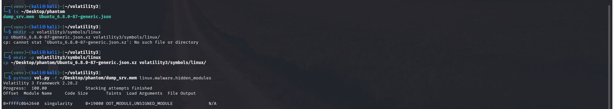
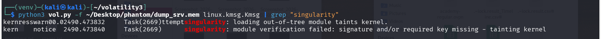
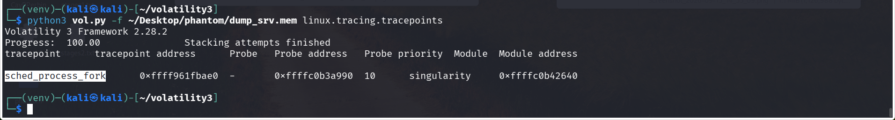
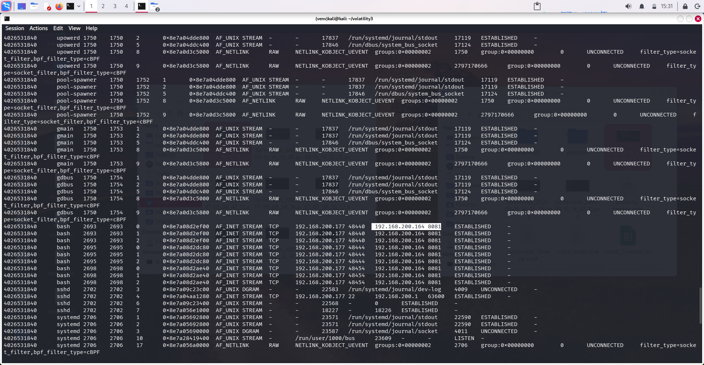
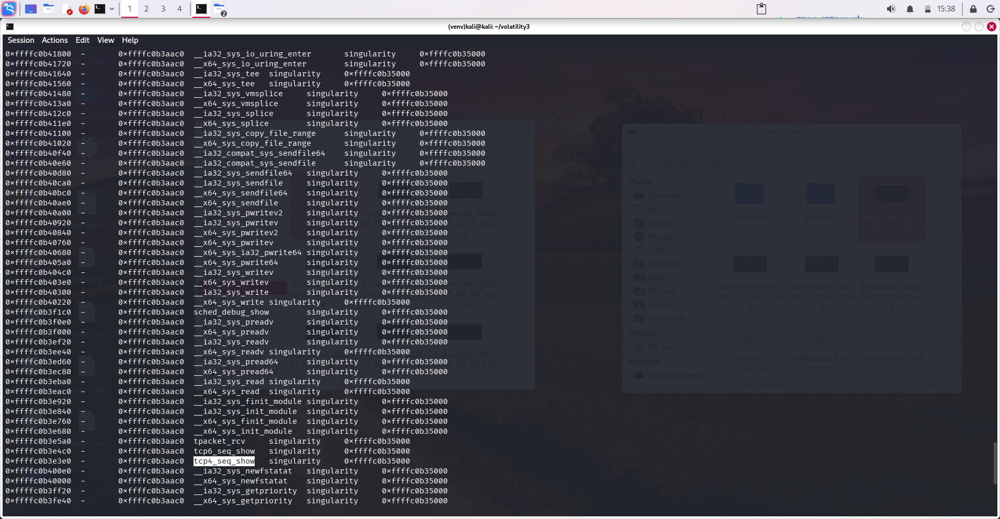
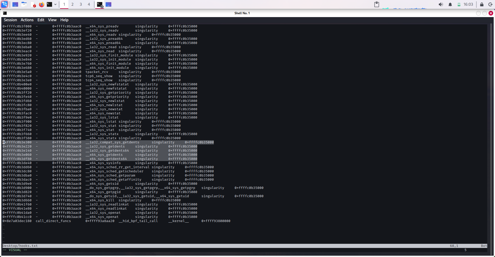
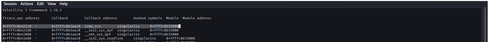

- 15.09.2026 21:24
This module is going to be about linux memory dump. Probably I will use volatility. 
Scenario is like this;
- A Linux server in your organization has been exhibiting suspicious behavior. Network monitoring detected unusual outbound connections to an unknown IP address, and system administrators noticed that several standard diagnostic commands were returning incomplete information. A memory dump was captured from the compromised server before isolation. Your task is to analyze this memory dump to uncover evidence of a sophisticated rootkit infection, map its capabilities, and document all indicators of compromise.
## Tasks

1. What is the name of the hidden kernel module? 
   I compressed the symbols file that came with memory dump using:
   xz -z phantom/Ubuntu_6.8.0-87-generic.json
command then copied Ubuntu_6.8.0-87-generic.json.xz into volatility3/linux/
and ran the command:

2. What kernel taint flags are set for the rootkit module? (comma-separated, alphabetical order)
	Screenshot above includes 2 flags: 
	- OOT_MODULE
	- UNSIGNED_MODULE
3. At what exact time (in seconds since boot) was the rootkit module loaded
   I used linux.kmsg.Kmsg plugin of volatility3 and filtered output according to name of hidden module. 
   Answer was 2490.473832
4. What was the PID of the process that loaded the rootkit module?
   Above screenshot shows Task(2669) which means PID of process was 2669.
5. Which kernel tracepoint is hooked by the rootkit? 
   Used plugin:linux.tracing.tracepoints
   Answer:sched_process_fork

6. What is the IP address of the command and control server? 
   I used linux.sockstat.Sockstat plugin after linux.netfilter.NetFilter plugin became unsuccessful. Since bash having connection to external device is suspicious I wrote down the ip address and port:
	- 192.168.200.164:8081
   
7. What port is the C2 server listening on?
	   Above screenshot showed the answer 8081
8. What are the PIDs of the compromised bash processes connected to the C2 server? (comma-separated, ascending order)
	    There was 3 bash process that was connected to external ip address. an the answer is 2693,2695,2698.
9. How many hooks has the rootkit installed?
		I used linux.ftrace.CheckFtrace module which gave me all hooks and I forwarded them to grep -c which essentially takes all lines with singularity word.  and Answer is 82
10. Which function is hooked to hide IPv4 network connections?
    linux.ftrace.CheckFtrace modules output shows tcp4_seq_show which is for hiding ipv4 connections and tcp6_seq_show which is for hiding ipv6 network connections.
    
11. How many variants of getdents syscalls are hooked?
    As we can see there is total of 5.
    
12. Which function is hooked to enable an ICMP-based covert channel?
	    icmp_rev is what we are looking for.
13. What is the memory address of the centralized callback function? (Format:0x\*\*\*\*\*\*\*\*\*\*\*\*)
	    I first tried multiple plugins. Specifically:
	- linux.malware.check_syscall.Check_syscall
	- linux.malware.check_creds.Check_creds
	- linux.malware.check_idt.Check_idt
	- linux.malware.ebpf.EBPF
	- linux.malware.netfilter.Netfilter
	- linux.malware.modxview.Modxview
		But answer was never supposed to be along them. I ran linux.tracing.ftrace.CheckFtrace which originally was showing syscall related to singularity. And there it already showed the memory address needed:
		
14. What is the value of the suspicious environment variable which leads to the escalation of privileges?
	    Here I used linux.envars.Envars, which shows all environment variables on system. I started looking through all the envars and saw an envar named OPERATOR. 
		Question was specifically asking envar about lateral movement. So OPERATOR with value of "access" is probably suspicious and answer was that.

And this way I finished Phantom sherlock.